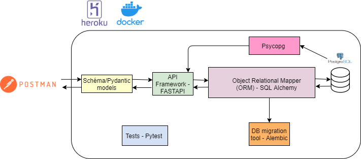

# Problématique:

1- Amazon Kindle fourni nos notes sous forme d'un csv ou bien un pdf,ce n'est pas pratique pour relire ses notes -

Actuellement, je fais un copier coller de chaque ligne du pdf dans un Microsoft word

Je cherche à l'automatiser

2- La gestion des photos sur Kindle est compliquée : à tel point que je prend en photo mon kindle 

contacter Amazon?

# Architecture logicielle

to do: changer chrome par postman

pourquoi psycopg et sql alchemy? car besoin de connaitre les id  de la BDD en read-only

# Architecture des données

###"posts"

- post_id Integer, primary_key

- title String

- post_created_at TIMESTAMP

- user_id Integer ForeignKey(users

###"users"

- user_id Integer primary_key

- email String

- password String

- user_created_at TIMESTAMP

# Fonctionalités 

to do: le mettre en diagramme UML

- post excel file
- auth et user
