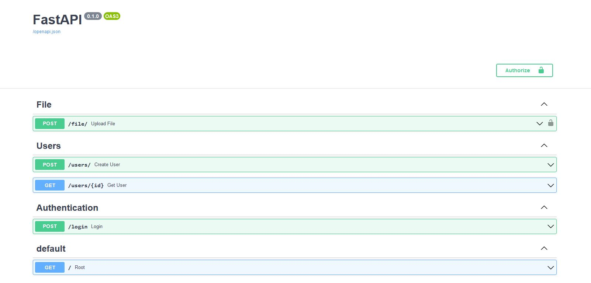

# Kindle note caster

Version v1.1

### Business problem:

Amazon Kindle give you your notes in a csv format (or a pdf),which is not handy to read your notes

Currently, I manually copy paste each line of the pdf in a Microsoft word, and then, I can add my post-reading comments.

I'm trying to automatize it and thus I built this productivity tool

This tool is an API and was supposed to be the backend of an app. The front end, is available in another repository, in the v1
. 

After login to the API, you can send a csv file and you will receive a file that you can save a .doc and work as you want on it.

You can also organise your notes. ( note that this feature is too complex to parameter for the user and has been remove in the v2 )

The conventions are:

- put your notes and highlighted texts in the return file

- if your note is tagged with @@something,
the note and the hightlited texts will be added to another file, stored on the server. 
The path of this file is parametered  thanks to the file_mapper.json file, that is set up on the server.

v1.2: 2 more roots should be added to the API ( one for sending the json, another for asking for files saved on each person personal space). 
Another plan was to add the folder at the bottom of the .doc. the sftp exchange is not considered

Thing to improve also: the management of files on the server side: to be sure that for each csv file received, a copy is not dowloaded -> memory management

In postman:  `save response`>`save to a file` and choose a doc file

But the v2 came before...

# possible improvment to this tool:

- the management of graphs/illustrations in books is not available using kindle yet

# Software "architecture" 

# data "architecture" 

### table "posts"

- post_id Integer, primary_key

- title String

- post_created_at TIMESTAMP

- user_id Integer ForeignKey

### table "users"

- user_id Integer primary_key

- email String

- password String

- user_created_at TIMESTAMP

# Fonctionalities

- post csv file
- auth et user

