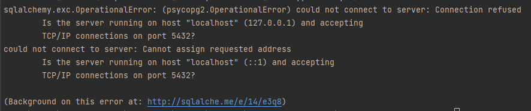

# How to run this project?

lien du tuto: https://www.youtube.com/watch?v=0sOvCWFmrtA&t=499s

#Database 


- télécharger postgre et pgadmin GUI

- aller sur pgadmin, entrer le mdp master et le mot de passe du user 'postgre'

- aller sur Schemas>Public>Table

https://www.postgresql.org/ftp/pgadmin/pgadmin4/v6.11/windows/

https://www.pgadmin.org/download/pgadmin-4-windows/

https://www.enterprisedb.com/postgresql-tutorial-resources-training?uuid=db55e32d-e9f0-4d7c-9aef-b17d01210704&campaignId=7012J000001NhszQAC

https://www.pgadmin.org/docs/pgadmin4/6.7/connect_to_server.html

problème: ne comprend pas pourquoi cela marche: après ré-installation et attente, soudainement ça a marché. 

# créer un environment 

pour mettre les codes de la db ( meme si écrit en clair dans mon code)

`py -3 -m venv venv`  le second venv est le nom que l'on a donné à l'environment

edit configurations> Use specified interpreter

`venv\Scripts\activate`

pour créer le fichier gérant les variables d'environments:

(à la place de les ajouter une à une dans le gestionnaire de variables )

```
DATABASE_HOSTNAME=
DATABASE_PORT=
DATABASE_PASSWORD=
DATABASE_NAME=
DATABASE_USERNAME=
SECRET_KEY=
ALGORITHM=
ACCESS_TOKEN_EXPIRE_MINUTES=
```


# le driver pour la bdd psycopg2

https://www.psycopg.org/docs/usage.html#passing-parameters-to-sql-queries

# installation des librairies et package python

pip install -r requirements.txt

### l'ORM ( Object relational Mapper): sqlachelmy

`pip install sqlalchemy`

### pydantic

`pip install pydantic[dotenv]`

`pip install pydantic[email]`

### API 

 télecharger uvicorn

`pip install uvicorn`

https://fastapi.tiangolo.com/deployment/manually/

lancer la commande depuis le dossier \kindle-note-caster\kindle-note-caster-api\app>

`uvicorn main:app --reload`

ou mieux aller sur postman

# AuthN management

### gestion de l'auth avec jwt/ Oauth2

`pip install python-jose[cryptography]`

commande pour générer arbitrairement la clé de l'algorithme, à mettre dans le .env:

`openssl rand -hex 32`

https://fastapi.tiangolo.com/tutorial/security/oauth2-jwt/

pour décoder les jwt:

https://jwt.io/

### passlib

Passlib is a password hashing library for Python 2 & 3, which provides cross-platform implementations of over 30 password hashing algorithms, as well as a framework for managing existing password hashes

`pip install passlib`

# Alembic ( db migration tool)

utile quand tu migres d'une db à une autre (de local à ubuntu VM puis à heroku)
en gardant les données

se mettre au niveau kindle-note-caster\kindle-note-caster-api

`pip install alembic` et `alembic init alembic` qui va créer les fichiers, il n'ya plus qu'à remplir

pour créer une version:
`alembic revision -m "titre de la révision` 
et on remplit le upgrade et downgrade

voir sur sur la doc> DDL details
https://alembic.sqlalchemy.org/en/latest/

to do: corriger les erruers quand on lance:
`alembic current`

puis pour voir ou est la tete:`alembic heads`

pour changer de version à celle au desus / en dessous:

`alembic upgrade head`

`alembic downgrade down_revision_id` ou `alembic downgrade -1` et on peut changer le 1 par n'importe quel nb


# errors:

Error loading ASGI app. Could not import module "main".  => aller dans le dossier kindle

# ?

python-multipart is an Apache2 licensed streaming multipart parser for Python
`pip install python-multipart`

# data processing

`pip install python-docx`

`pip install pandas` voir les versions au plus clair: 1.2.4 ou 1.4.3?

exemple pour la config du file_mapper.json:

```json
{
"marketing": "Lecture/Marketing.docx",
"sales": "Lecture/Sales.docx"
}
```

# documentation

disponible à l'adresse: http://127.0.0.1:8000/docs

# deploiement

### Heroku ( platforme de déploiement de SFDC)

installer en local heroku https://devcenter.heroku.com/articles/getting-started-with-python#set-up

`heroku --version` pour savoir si bien installé

problème car le cmd ( invité de commande) reconnait bien mais pas le terminal intelliji ( microsoft powershell)
variables d'environment mal configurées -> juste besoin de redémarrer l'IDE

 suivre le tuto ( du coup quel interet pour moi de faire cela?)

 `heroku create nomapp` , nom de l'app globale
 
`git push heroku main` on va pousser sur l'instance remote "heroku" notre code

#### TO DO avec heroku 

pour déployer sur heroku, méthode de détection: requirements à la racine du projet github

=> importance de faire un projet github uniqueemnt dédié au projet

=> création d'un nouveau projet github

=> pb pour utiliser pip

https://pip.pypa.io/en/stable/installation/

=> seconde solution: mettre le procfile et le requirements à la racine de du projet 2014-P

=> 3ème: vider tout ce qui ne concerne pas ce projet et le mettre dans un nouveau repo github


### Docker ( on ne déploie plus une VM mais un container)

lancer docker desktop et

`docker pull python` inutile? 

`docker build -t kindle-note-caster-app .` # inutile car build dans le docker compose??

`docker image ls` pour voir toutes les images

`docker-compose up -d` comment on applique le docker-compose-prod? 

`docker ps -a` pour voir les containers

`docker logs nom_du_container` pour voir les logs d'un container

`docker compose down` ( pareil sans le - ? )

et après on accède via fast api comme d'habitude, il y aura une redirection


# TO DO:

## MUST HAVE

- Deploy app to heroku (section 13)

- Automatic tests with pytests ( section 16) 

- essayer de le mettre en event driven architecture avec redis et un front

## NICE TO HAVE

- gestion des print et des logging

https://pythonexamples.org/python-logging-info/

- remettre de l'ordre dans mes terminaux, ou les imports se font

- remettre de l'ordre dans mes imports entre les dossiers, et lire:

https://iq-inc.com/importerror-attempted-relative-import/

- terminer la relecture de mes notes

- faire la page web qui appelle ce service

https://stackoverflow.com/questions/64168340/how-to-send-a-file-docx-doc-pdf-or-json-to-fastapi-and-predict-on-it-without

- à creuser: bel affichage d'un dataframe dans un terminal intelliji 

- transfomer ces print en console.log

- refaire le git ignore de Lecture

- la db semble avoir un pb au démarrage, reloading de la db
-> il y a un drop de toute la base, c'est la raison d'utilisation de Alembic

- faire un fstring pour apprendre

- recorriger les doctypes

- pourquoi dans mon requirement, j'ai des trucs comme cela:
jsonschema @ file:///tmp/build/80754af9/jsonschema_1602607155483/work

- comprendre pourquoi autant de consommation de ressource alors que container taille inférieure VM

-revoir le nommage des colonnes pour respecter celles d'amazon

# la ou j'en suis:

docker compose: soucis pour connecter la base de donnée
le code a été mis dans un try catch mais ce n'est pas le bon code qui est compilé par 

