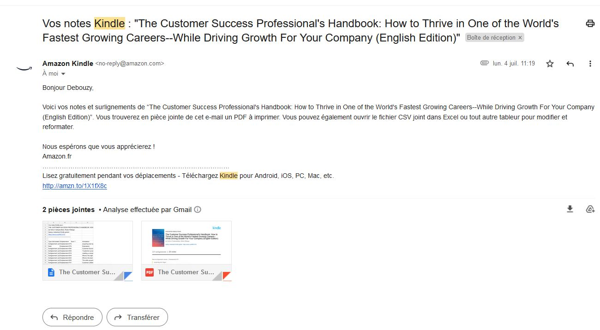
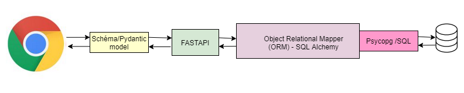

# Problématique:

1- Amazon Kindle fourni nos notes sous forme d'un csv ou bien un pdf,ce n'est pas pratique pour relire ses notes -

Actuellement, je fais un copier coller de chaque ligne du pdf dans un Microsoft word

Je cherche à l'automatiser

2- La gestion des photos sur Kindle est compliquée : à tel point que je prend en photo mon kindle 

contacter Amazon?

# Architecture:

